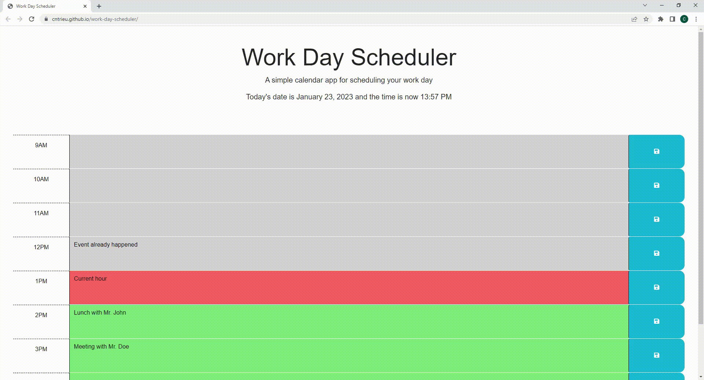

# Work Day Scheduler

To visit the application, visit: https://cntrieu.github.io/work-day-scheduler/

## Usage

Through the use of third-party APIs, this website is able to be used as a scheduler for a typical 9am-5pm workday. This scheduler changes colour depending on the time it is visited to alert which hours are in the past, present, or future. We can type in anything into the specified text area fields and click on the save button to save our schedule.

APIs used:
* jQuery
* DayJS

Here is a gif preview of the application:

